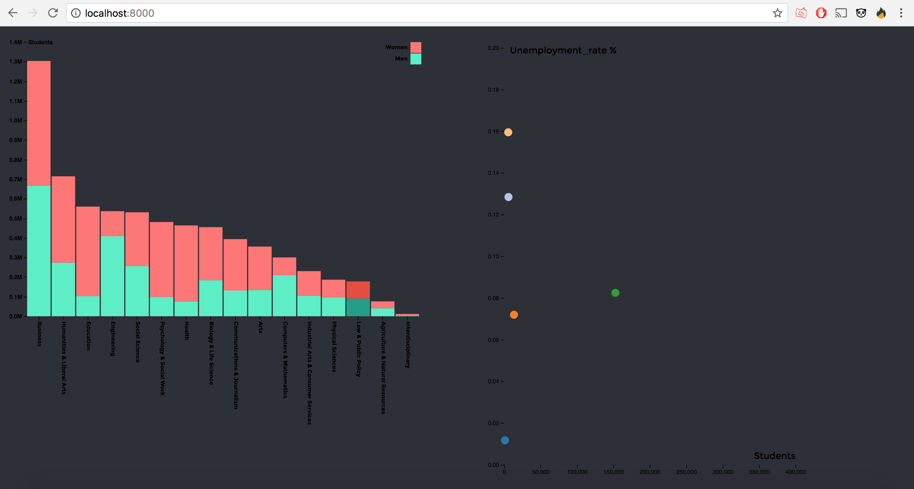

# assessment 2

This assessment shows i can make an interactive chart based on dirty data.
The charts and code will be the same as my 3rd assessment, this is because i do clean in that assessment aswell.


## Data
The data is taken from the fivethirtyeight github repository, it's called /college majors
[link to dataset](https://github.com/fivethirtyeight/data/tree/master/college-majors)

### What does the data tell?
This data has some interesting statistics about majors:
- the name of the major
- what category this major belongs to
- how many students this major has
- the amount of men and the amount of women
- the amount of people who are employed
- amount of part-time and full-time employed
- the amount of people who are unemployed
- the unemployment rate

& a lot more, but we won't be using all of the data

### So what data are we using?
In this assessment we'll be using the following data from the source:
- the major names
- the major_category
- the amount of men and women
- the total amount of students
- the unemployment rate

## Cleaning

All majors in this file have their own name and statistics (total of 173). To make this readable in a chart i need to categorize the majors into their own category. luckily all rows have a major_category, wich tell us what sector this major belongs to.

We are going to make a new dataobject that will store the data in categories instead of 173 single entries

```javascript
var dataTest = {};
```
we loop trough the .csv and check for "major_category", "men" and "women".
we check to see if the current major_category is already inside dataTest,
- if it is, we add .men .women and .total to that category in dataTest
- if it isn't, we first add the current major_category and then add .men .women and .total to that category

```javascript
d3.csv("data2.csv", function(d, i, columns) {
  var newColumns = ["Major_category", "Men", "Women"]
    for (i = 1, t = 0; i < newColumns.length; ++i){
      t += d[newColumns[i]] = +d[newColumns[i]];
    }
    if(d.Major_category in dataTest){  
      dataTest[d.Major_category].Men += parseInt(d.Men);
      dataTest[d.Major_category].Women += parseInt(d.Women);
      dataTest[d.Major_category].total += parseInt(t);
    }else{
      dataTest[d.Major_category] = {};
      dataTest[d.Major_category].Men = parseInt(d.Men);
      dataTest[d.Major_category].Women = parseInt(d.Women);
      dataTest[d.Major_category].total = parseInt(t);
    }
};)
```

This code makes it so the data is categorized in their own major category, this means all engineering majors will now be under "engineering" and all arts majors are under "arts" for example.

you can also see the parseInt before the data, i do this to so i get a number instead of a string as return.

In order to make the rectangles in the stacked bar chart clickable i need to give each bar a class with the name of the major. This way i can check wich major is selected.

```javascript
.enter().append("rect")
  .attr("x", function(d) { return x(d.data.Major); })
  .attr("y", function(d) { return y(d[1]); })
  .attr("height", function(d) {return y(d[0]) - y(d[1]); })
  .attr("width", x.bandwidth())

  .attr("class", function(d) { return d.data.Major.replace(/[^A-Z0-9]/ig, ""); })
```

d.data.major will be the name of the class, but some of the majors have spaces in their names. A class can't have a space in it so i use .replace to only allow characters from A to Z and 0 to 9, the spaces will be removed.

```javascript
var keys = data.newColumns.slice(1);
```

make it so var keys holds "men" and "women", the first item in newColumns holds something we don't need.
var keys will be used to make the legend.

## features
* [D3](https://d3js.org/)
* [Data](https://github.com/fivethirtyeight/data/tree/master/college-majors)
* [Author](https://b.locks.org/mbostock)
* [D3 scaleBand](https://github.com/d3/d3-scale/blob/master/README.md#scaleBand)
* [D3 csv](https://github.com/d3/d3/wiki/CSV)
* [D3 map](https://github.com/d3/d3-collection/blob/master/README.md#map)
* [D3 transition](https://github.com/d3/d3-transition/blob/master/README.md#transition)
* [D3 select](https://github.com/d3/d3-selection/blob/master/README.md#select)
* [D3 selectAll](https://github.com/d3/d3-selection/blob/master/README.md#selectAll)
* [Selection append](https://github.com/d3/d3-selection/blob/master/README.md#selection_append)
* [Selection attr](https://github.com/d3/d3-selection/blob/master/README.md#selection_attr)
* [Selection enter](https://github.com/d3/d3-selection/blob/master/README.md#selection_enter)

## License
GPL 3.0 © 2017 Jimmy de Kroon
